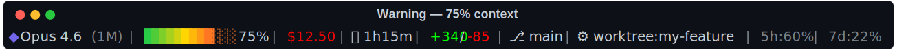

# claude-code-statusline

A gradient, information-dense status line for [Claude Code](https://code.claude.com).
Model, context usage, cost, git branch, rate limits — one glanceable line, with
zero-value fields hidden so it never looks cluttered.

## Preview





## Features

- True-color gradient context bar (green → yellow → red), falls back to ANSI-256 or ASCII
- Zero-value fields — cost, duration, lines changed, rate limits — hide automatically
- Cost turns red above $10
- Git branch + dirty indicator, cached for 5s so it doesn't slow down every keystroke
- Rate limit tracking (5-hour / 7-day), red above 80%
- Worktree / agent indicator for multi-agent workflows
- Optional Nerd Font glyphs and Powerline-style separators

## Install

Requires [`jq`](https://jqlang.org/) (`brew install jq` on macOS).

Quick install — downloads the script directly, no clone needed:

```bash
mkdir -p ~/.claude
curl -fsSL https://raw.githubusercontent.com/leewest0/claude-code-statusline/main/statusline.sh -o ~/.claude/statusline.sh
chmod +x ~/.claude/statusline.sh
```

Or, if you'd rather clone the repo and read the script first:

```bash
git clone https://github.com/leewest0/claude-code-statusline.git
cp claude-code-statusline/statusline.sh ~/.claude/statusline.sh
chmod +x ~/.claude/statusline.sh
```

Add to `~/.claude/settings.json` (merge if you already have one):

```json
{
  "statusLine": {
    "type": "command",
    "command": "~/.claude/statusline.sh",
    "timeout": 10
  }
}
```

Restart Claude Code — the status line appears after your first message.

## Try it first

Preview the rendering in your own terminal before wiring it into `settings.json`:

```bash
./examples/test-mock.sh            # all four scenarios
./examples/test-mock.sh danger     # just one: normal | warning | danger | startup
```

## Configuration

Set these in your shell profile (`~/.zshrc` / `~/.bashrc`) before launching Claude Code:

| Variable | Effect |
|---|---|
| `CLAUDE_STATUSLINE_ASCII=1` | Plain ASCII — no color, no unicode |
| `CLAUDE_STATUSLINE_NERDFONT=1` | Nerd Font glyphs instead of unicode symbols |
| `CLAUDE_STATUSLINE_POWERLINE=1` | Powerline arrow separators (on by default with Nerd Font) |

`COLORTERM=truecolor` (usually already set by your terminal) enables the 24-bit
gradient; otherwise it falls back to a fixed-threshold ANSI-256 palette.

See the [official statusLine docs](https://code.claude.com/docs/en/statusline) for
the full JSON schema Claude Code provides.

## License

MIT — see [LICENSE](LICENSE).
